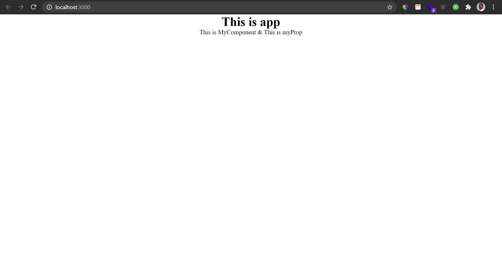

## simple-react-app

This is a very lightweight react app for testing libraries and components outside of your large codebase.

## set-up

`git clone https://github.com/kevinjmosley93/simple-react-app.git`
`npm i`
`npm start`

